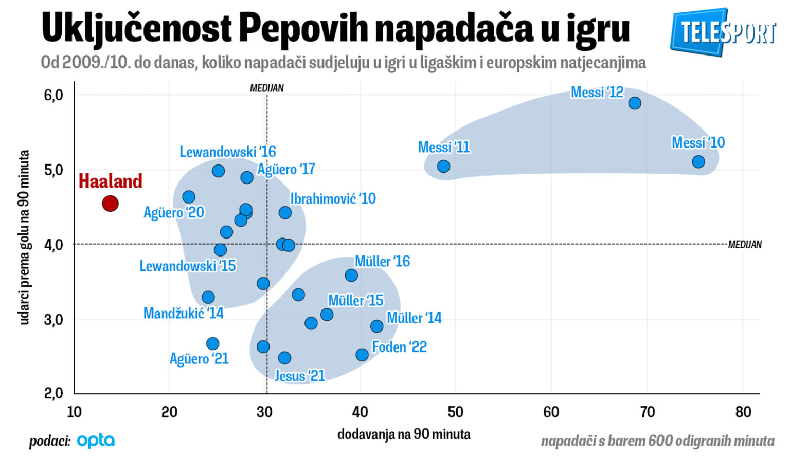

Na kraju je Everton do boda u Merseyside derbiju došao golom Jamesa Tarkowskog debelo u sudačkoj nadoknadi, ali ključni potez utakmice dogodio se oko 20. minute kada je David Moyes adaptirao igru svoje momčadi.

Everton je u utakmicu protiv Liverpoola ušao s idejom pritiska na desnog beka. Arne Slot onamo je postavio Conora Bradleyja, a Ilman Ndiaye i Beto dobili su zadatak iskakati prema njemu i pokušavati mu oduzeti loptu  kako bi se došlo u dobru poziciju za kontranapad. No, plan nije  funkcionirao. Bradley je u najgorem slučaju imao opciju povratne lopte  na vratara, a onda je Alisson rješavao Evertonov  pritisak okretanjem strane na suprotnog beka ili provlačenjem lopte na  zadnje vezne i Liverpool je iznosio loptu.

Moyesova inicijalna ideja svodila se na to da bude koliko-toliko  proaktivan. Bio je svjestan da teško može biti imati inicijativu s  loptom, tako da je svojoj momčadi pokušao dati iskru riskantnijim  igranjem u obrani. Pokušao je napasti slabu točku u Liverpoolovoj  izgradnji napada, ali kako se pokazalo da je i ta slaba točka dovoljno  jaka, Moyes se odlučio proaktivni pristup promijeniti u reaktivni.  Umjesto da napadne Liverpoolove slabe točke, Moyes je od 20. minute  odlučio usmjeriti koncentraciju na poništavanje najveće snage Slotove  momčadi.

## Pojačanja imaju jednu zajedničku karakteristiku

Everton je do 20. minute imao 14 pritisaka na vratara i zadnju liniju suparnika, a do kraja utakmice samo 12. Moyes je svoju prednju liniju  naprosto usmjerio tako da blokira linije dodavanja između Liverpoolove  zadnje linije i Ryana Gravenbercha, a Alexisa Mac Allistera je branio tako što je na njega zalijepio ‘flaster’. Takav pristup doveo je do toga da je Liverpool imao ozbiljnih problema u dolasku prema  naprijed, barem u volumenu na koji je Slot u svom mandatu navikao.

Odlična ilustracija toga je to što je Virgil van Dijk imao 107 dodavanja i bio najkorišteniji Liverpoolov igrač. Iza njega je bio Ibrahima Konaté, pa Andy Robertson, pa Bradley. Za usporedbu, Gravenberch je imao 20 točnih dodavanja na  utakmici, što je puno manje od njegovih standardnih 49,2. Stoji i to da  je Slot izvadio Gravenbercha u 61. minuti, ali tada je izašao i Bradley, pa je svejedno imao gotovo dvostruko više pasova.

Everton je svojim pasivnim postavljanjem i fokusom na blokiranje  linija dodavanja prema Gravenberchu naprosto prisilio Liverpool da kruži loptom u zadnjoj liniji i traži priliku za izlazak iz svoje polovice, a time je, ironično, više ograničio suparnika nego kad ga je agresivno  napadao.
